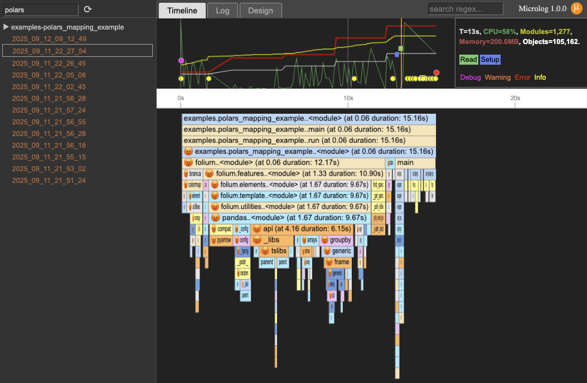
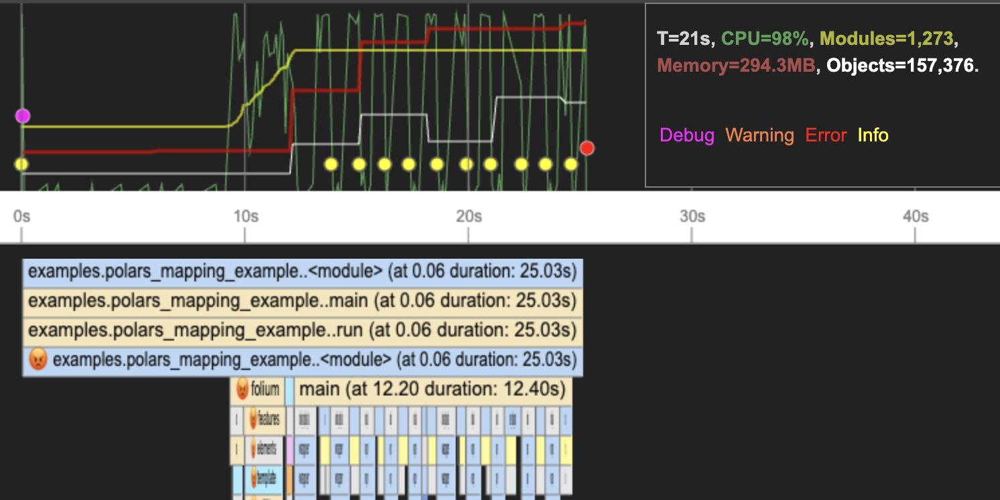
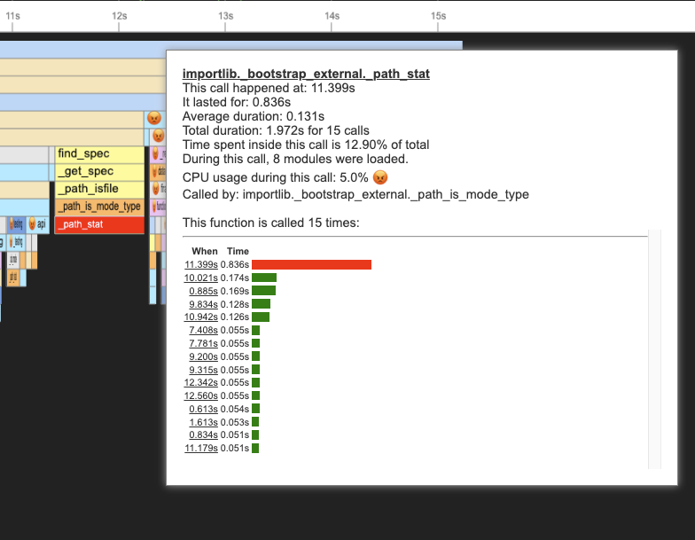
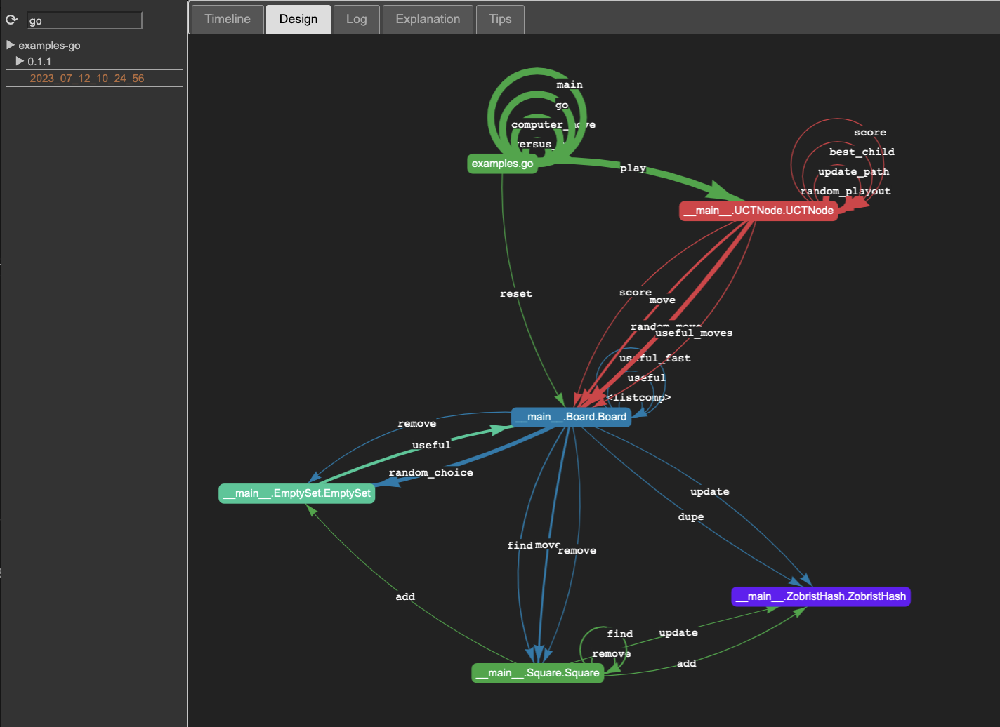
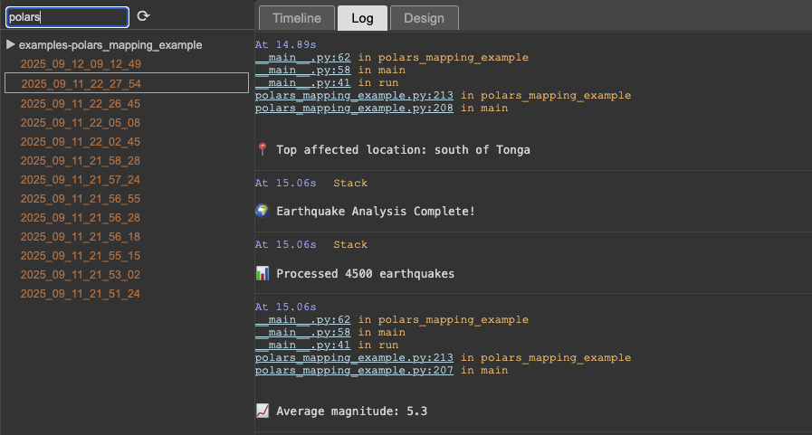
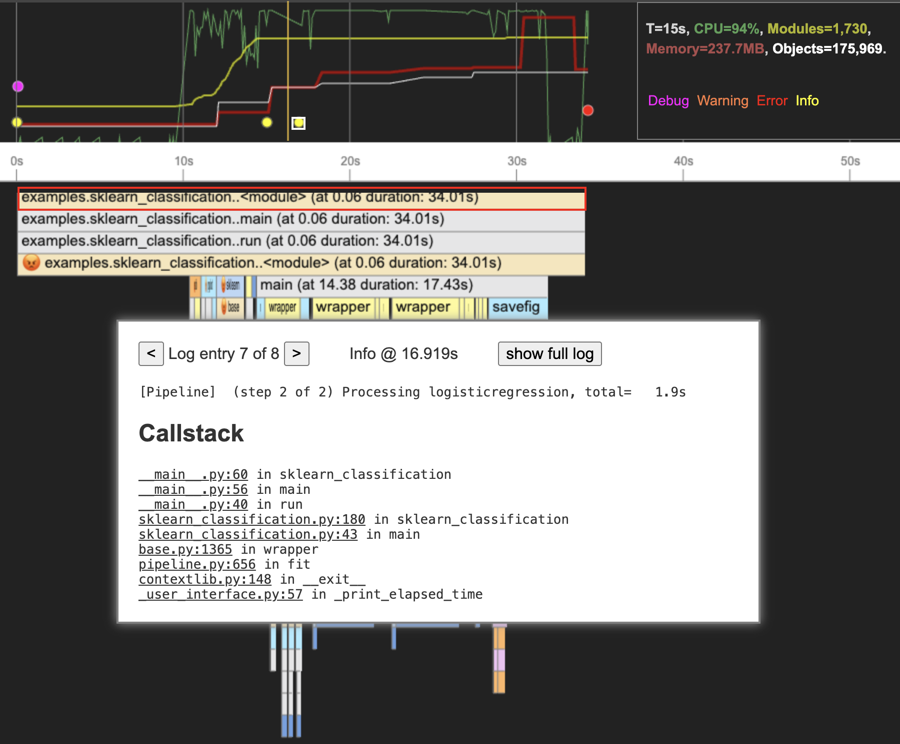
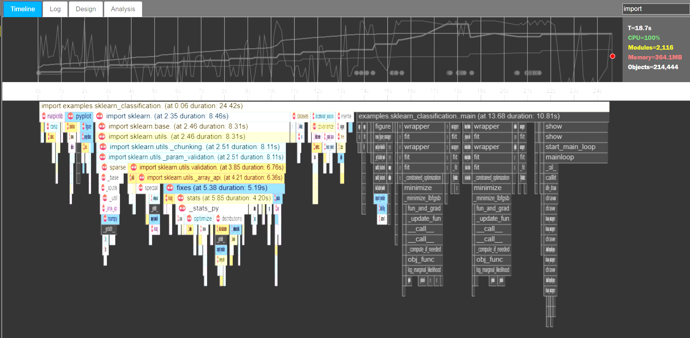

# Microlog

Microlog is a lightweight sampling profiler.
The tracer, server, and UI are all written in Python.
Recordings are tiny. Microlog has minimal recording overhead with an average 1% overhead.

# Using Microlog from the command line

To run Microlog on an entire Python script, use the following pattern:

```bash
$ uv add micrologai
$ uv run python -m microlog "<your name>-<useful label>" -m your.own.module ...
```

For concrete examples on how to call Microlog from the command line, see:
[examples/run_all.sh](/examples/run_all.sh).

# Using Microlog from your Code

To run Microlog on a subset of your code, add `microlog` to your project's
dependencies in `pyproject.toml`. Then use the following pattern:

```python
with microlog.enabled("<your name>-<useful label>"):
    run_any_code()
```

Alternatively, you can use this pattern, which is used in
the example Jupyter Notebook, 
[examples/treemap.ipynb](/examples/treemap.ipynb):


```python
microlog.start("<your name>-<useful label>")
# do your work
microlog.stop()
```

# Viewing the Result

At the end of your run, Microlog will print something like this:

```
┏━━━━━━━━━━━━━━━━━━━━━━━━━━━━━━━━━━━━━━━━━━━━━━━━━━━━━━━━━━━━━━━━━━━━━━━┓
┃ Microlog: https://localhost:7777/#microlog-hello/2025_08_29_14_01_59/ ┃
┗━━━━━━━━━━━━━━━━━━━━━━━━━━━━━━━━━━━━━━━━━━━━━━━━━━━━━━━━━━━━━━━━━━━━━━━┛
```

It makes sense to choose a meaningful recording label to avoid confusion.

# Viewing Microlog recordings

Your recordings will show up at [localhost:7777](https://localhost:7777).
To render Microlog recordings, you will first need to start the server:

```bash
$ uv run python src/microlog/server.py
```

# Setting Up S3 Environment Variables

To save and load Microlog recordings from a given S3 bucket, set:

```bash
$ export MICROLOG_S3_REGION="the AWS region used"
$ export MICROLOG_S3_ROOT="the path to your S3 Bucket"
```

In addition, you will need to [set up your S3 credentials](https://s3fs.readthedocs.io/en/stable/#credentials) so that `s3fs` can 
connect securely to your bucket.

If you are hosting your Microlog server as a hosted service set the following:

```bash
$ export MICROLOG_SERVER="https://the.url.to.your.hosted.server"
```

To disable Microlog for a given run, especially useful when you use the 
`microlog.enabled` context manager, use:

```bash
$ export MICROLOG_DISABLE="true"
```

To following three advanced parameters influence the frequency at which 
Microlog samples and collects data. Each come at a cost and may slow 
down the original code more or less, depending on the scenario. The smaller
the freqency, the more often the sample runs, and the recording will grow
larger.

```bash
export TRACER_STATUS_DELAY="0.1"
export TRACER_MEMORY_DELAY="1.0"
export TRACER_SAMPLE_DELAY="0.05"
```

The values above are in seconds. In this example, Microlog samples the stacks
in all threads in the process every 50 milliseconds.

# The Microlog UI

The main elements of the Microlog UI are:

- `Log treeview`, at the left, showing currently available logs, with an optional filter.
- `Timeline`, the starting point for analysis of your application.
- `Log`, listing all print and logging output and statistics in a chronological order.
- `Design`, showing a graphical rendering of the structure of the application.

Here is an example for a back test:



## Timeline

The timeline shows lines and dots of different colors providing insights into resource consumption happening
during a giving time range:



The graph colors mean the following:

- `green`: CPU consumption. We would ideally see the line being high, in other words, at 100% CPU.
  When the green line is low, it almost always indicates I/O, either reading or writing.
- `red`: Process memory consumption. This is Python process, Python heap, and native memory held by libraries
  such as Polars, Pandas, and Numpy.
- `yellow`: Number of modules imported so far, during this run.
- `white`: Number of objects on the heap.

When moving the mouse, a popup window shows the values for the above four resources.
The timeline can be also panned and zoomed with the mouse.
More details will be shown in the timeline when zoomed in deeper.

## Multiple Threads

For each thread in a run, Microlog shows a checkbox in the flame graph.
Sometimes, the main thread is the second or third thread showing.
In such case, simply click the corresponding checkbox

## Timeline Anomaly Detection

When a method is selected in the flame graph, such as is done for `importlib` below, the popup shows information about similar calls detected in the same run, showing when they ran and how long they ran. _Microlog_ also uses anomaly detection to highlight methods you may want to investigate in more detail.



Automatic anomaly detection, call stack analysis, and process health indicators offered by _Microlog_ allow you to debug performance/quality issues quickly.

# Design

The Design tab analyzes the runtime call graph and draws a structural diagram of the underlying design of your application.



The thickness of each line corresponds to the total amount of time spent inside the call(s). To rearrange
the graph, you can drag one of the nodes.

# Log

The log tab contains a chronological listing of all print and logging output, statistics, and analysis performed by _Microlog_ in a more traditional linear log style. The main distinghuising feature of Microlog is the recorded stack traces



Log entries are also laid over the timeline, making it easier to locate log entries produced inside a given call.



_Microlog_ detects calls to `print` and `logging`. Those calls are automatically intercepted and
added to the _Microlog_ event log. The log entries are shown in the UI in the `Timeline` and
`Log` tabs. A key difference with regular logging solutions is that Microlog also records
the actual stack trace where the message was generated. This helps navigating from log to
source code.

# Search Highlights

When searching for a regular expression using the top-right search input
field, the flamegraph and timeline are filtered to highlight a given
item of interest. This makes it easier to find a given class, method, package, or printed string in the UI.



# Source Links

Microlog shows source links in markers and flamegraph spans. 
When you follow those links, the corresponding source file 
should open in VS Code.

# Developer Notes

To release a new version to PYPI, first check if you have permission to do so. Then update the version in [pyproject.toml](pyproject.toml) and run:

```bash
rm dist/*
uv run -m build
twine upload dist/*
```

# License

_Microlog_ is released under the [MIT License](/LICENSE).