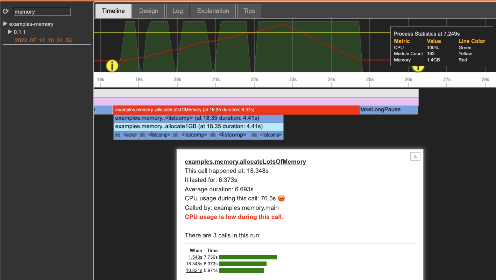

# microlog.ai

_Microlog_ is a continuous profiler and logger for the Python language.
Logs and performance profiles are collected and analyzed.
_Microlog_ explains application behavior using interactive graphs.
It summarizes and explains the code using AI.

_Microlog_ makes understanding complex applications easy, reducing support costs
and shortening production problems, increasing application quality, and minimizing outages.

# Installing microlog.ai

To install and enable _Microlog_ as a continuous profiler, run the following:

```
  git clone https://github.com/micrologai/microlog
  python3 -m setup install
```

# How to use microlog.ai

Any time a Python process runs, it will trigger _Microlog_ to generate a recording. Here is an example:

```
  python3 examples/helloworld.py
```

This produces the following output:

```
hello world
Run 0
hello world
Run 1
hello world
Run 2
------------------------------------------------------------------------------------------
Microlog Statistics:
------------------------------------------------------------------------------------------
- log size:    2,998 bytes
- report URL:  http://127.0.0.1:4000/log/examples-helloworld/0.1.0/2023_06_12_18_14_22
- duration:    3.058s
------------------------------------------------------------------------------------------
```

The report URL is rendered by the _Microlog_ server implemented in `microlog/server.py`.

# The Microlog.ai UI 

The _Microlog_ UI consists of various sections: a timeline, design, log, explanation, and tips. 

In the timeline, the status bar shows general information about the process. It also shows logging entries captured by the _Microlog_ runtime. The runtime also includes an automatic, continuous profiler. The resulting flame graph is rendered by Microlog without requiring any instrumentation in the code. 


## Timeline Navigation and Zoom

Using the mouse, the dashboard can be panned and zoomed. More details will be shown when zoomed in deeper:



## Timeline Anomaly Detection

When hovering over a call, it is highlighted in red, and details for the call are shown in a popup dialog.

In the case below, _Microlog_ detected four anomalies. Each took longer than average. The current call is also an anomaly:
 - It took almost 6 seconds, whereas the average is below 4 seconds. 
 - The top bar shows the CPU consumption during the call, which is suspiciously low for about 1.5 seconds. 
 - All this resulted in the total CPU consumption during the call being below 66%. 
 - For around 33% of the time, the process was waiting. Typically, this indicates bottlenecks elsewhere in the system, such as waiting for data to arrive from a micro-service. 

Automatic anomaly detection, call stack analysis, and process health indicators offered by _Microlog_ allow you to debug performance/quality issues quickly.


## Timeline Detecting expensive I/O or Starved Processes

The top bar shows general statistics for the process, such as CPU and number of modules loaded over time. 
Note that a low CPU in the top bar, typically means I/O took place at that moment, either from the local disk or from the network:


## Timeline Integrating Profiling with Logging

Log entries are shown as visual markers in the top bar. Because _Microlog_ shows log entries on the timeline, analyzing problems becomes much easier than with normal logs. No more scrolling page after page to find a stack trace. With _Microlog_, they appear as easy-to-see stop signs:


## Formatting Logs with Markdown

Log entries can be formatted using Markdown to make it easier to show important information to the reader.


# Logging 

_Microlog_ detects calls to `print` and `logging`. Those calls are automatically intercepted
added to the _Microlog_ event log.  

Manual log entries can be inserted into Microlog using `info`, `warn`, `debug`, and `error`:

```python
   print("Add a log entry to microlog with an info marker...")
   print("... or as an error marker.", stream=sys.stderr)

   import logging
   logger = logging.Logger("Microlog Demo")

   logger.info("Add a log entry to microlog with an info marker...")
   logger.debug("... or a bug marker...")
   logger.warning("... or a warning marker...")
   logger.error("... or an error marker.")
   
   microlog.info("Add something to the log explicitly...")
   microlog.warning("... as a warning...")
   microlog.debug("... as a debug message...")
   microlog.error("... as an error.")
```

# Developer Notes

## Run all unit tests

```
python3 -m unittest discover tests
```


## Run all examples

```
source examples/runall.sh
```

# License

_Microlog_ is released under version 1 of the [Server Side Public License (SSPL)](LICENSE).
