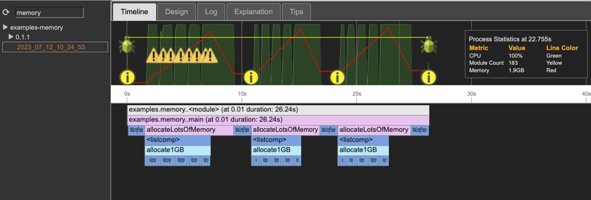
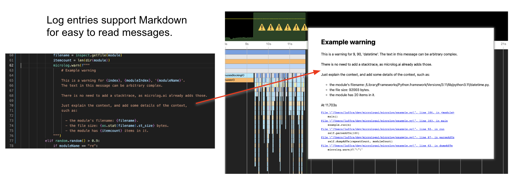

# microlog.ai

microlog.ai is an AI-driven approach to observability and monitoring.

# Installing microlog.ai

```bash
  git clone https://github.com/laffra/microlog
```

# Enabling microlog.ai

```python
  import microlog

  microlog.start(
      application="Example",
      version=1.0,
      info="Just testing",

      showInBrowser=True,   # this loads the local log in the browser when finished
      verbose=True,         # this prints out statistics about microlog
  )
``` 

That's all you need to do to get going. microlog.ai is an AI-driven monitoring solution that 
will observe your code while it is running, analyze the metrics, and produce easy to use 
dashboards for observing the health of your system, set SLOs, and register alerts.

# Logging 

Manual log entries are inserted into microlog using `info`, `warn`, `debug`, and `error`:

```python
   microlog.info("add something to the log")
```

# The Microlog.ai UI 

The microlog.ai UI consist of four main sections: a status bar, a timeline, and a flame graph. The status bar shows general information about the process and manually created log entries. The flame graph is generated automatically by microlog, without needing any instrumentation in the code. 



# Navigation and Zoom

Using the mouse, the dashboard can be panned and zoomed. More details will be shown when zoomed in deeper:


# Anomaly Detection

When hovering over a call, it is highlighted in red and details for the call are shown in a popup dialog.

In the case below, microlog detected four anomalies. Each took longer than average. The current call is also an anomaly:
 - It took almost 6 seconds, whereas the average is below 4 seconds. 
 - The top bar shows the CPU consumption during the call which is suspiciously low for about 1.5 seconds. 
 - All this resulted in the total CPU consumption during the call to be below 66%. 
 - For around 33% of the time, the process was waiting. Typically, this indicates bottlenecks elsewhere in the system, such as having to wait for data to arrive from a micro-service. 

Automatic anomaly detection, call stack analysis, and process health indicators offered by microlog.ai allow users of microlog.ai to quickly debug performance/quality issues.


# Detecting expensive I/O or Starved Processes

The top bar shows general statistics for the process, such as CPU and number of modules. Low CPU typically means I/O, either from local disk or from the network:


# Integrating Profiling with Logging

Log entries are shown as visual markers in the top bar. Because microlog.ai shows log entries on the timeline, analyzing problems becomes much easier than with normal logs. No more scrolling page after page to find a stacktrace. With microlog.ai they appear as easy to see stop signs:


# Formatting Logs with Markdown

Log entries can be formatted using Markdown, to make it easier to show important information to the reader.




# Developer Notes

## Run all unit tests

```
python3 -m unittest tests
```
